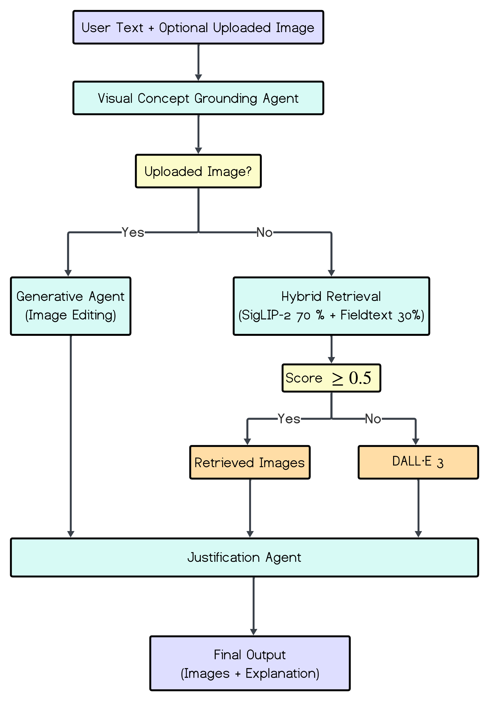

# SmartMatch: Multimodal Image Recommendation via SigLIP-2 and Claude

---

## 3. System Architecture

SmartMatch is built as a multi-agent pipeline where each agent is responsible for a distinct stage of the image recommendation process. The system accepts a piece of user-written text as input, along with an optional uploaded image, and returns a ranked set of images each accompanied by a natural-language explanation. All agents are initialized and coordinated through a single pipeline entry point, which passes structured outputs between stages and handles the decision between retrieval and generation.

{width=50%}

---

### 3.1 Pipeline Overview

The pipeline follows one of two paths depending on whether the user provides an uploaded image. If the user uploads an image, the system runs visual concept grounding and passes the result directly to the Generative Agent for image editing. If no image is uploaded, the system runs hybrid retrieval over the full dataset and checks whether the top similarity score meets a threshold of 0.5. If the score is sufficient, the retrieved images are passed forward. If not, the system falls back to DALL-E 3 to generate images from scratch. In both paths, the final step is the Justification Agent, which adds a natural-language explanation to each result before returning the output.

---

### 3.2 Agent Descriptions

#### Visual Concept Grounding Agent

The first stage of the pipeline addresses a well-known limitation of embedding-based retrieval: abstract or emotionally rich text does not map well to visual feature spaces. For example, a user writing "feeling burnt out after a long week" is expressing a feeling, not describing an image. The grounding agent takes this raw text and transforms it into a structured visual description using Claude (`claude-haiku-4-5-20251001` via the Anthropic API). The output is a JSON object with seven fields:

| Field | Description |
|---|---|
| `visual_description` | A rich sentence describing what the ideal image would look like |
| `scene` | Scene and setting keywords |
| `mood` | Emotional and atmospheric keywords |
| `style` | Visual style keywords |
| `lighting` | Lighting conditions |
| `color_palette` | Dominant colors and tones |
| `intent` | Likely use case: professional, editorial, or social |

The agent includes retry logic with up to three attempts and returns a safe fallback response if the model fails, so the rest of the pipeline is never blocked by a single failure. All prompts are kept in a separate `prompts.py` file, which makes it straightforward to improve grounding quality without modifying the agent logic.

#### SigLIP-2 Semantic Retrieval Agent

This agent performs cosine similarity search over a pre-computed embedding index of 25,000+ images from the Unsplash dataset. The grounding output fields are concatenated into a single query string, which is encoded using the `google/siglip-base-patch16-224` model. The resulting text embedding is compared against pre-computed image embeddings using L2-normalized dot product similarity. The agent returns the top-k images ranked by similarity score, along with each image's photo ID, URL, and caption.

#### Hybrid Field Text Retrieval Agent

To improve retrieval quality beyond a single concatenated query string, a second retrieval agent scores images using per-field semantic embeddings. Using OpenAI's `text-embedding-3-large` model, the agent computes separate embeddings for `visual_description`, `mood`, and `color_palette` and scores each field independently. The final score for each image is a weighted combination of SigLIP-2 similarity (70%) and field-level text similarity (30%), with each field contributing equally. This hybrid approach captures both visual and semantic alignment, and was introduced specifically to address low retrieval scores observed when using a single query string alone.

#### DALL-E 3 Fallback Generation

If the top hybrid retrieval score falls below 0.5, the system falls back to generative image synthesis using DALL-E 3. The grounding output is used to construct a photorealistic generation prompt with strict realism constraints. Three style variants are generated to provide diverse candidates: a cinematic wide shot, a documentary medium shot, and a high-contrast noir. The generated images are scored against the original text embedding and the best-scoring results are returned.

#### Justification Generation Agent

The final stage adds a natural-language explanation to each recommended image. The justification agent takes the user's original text and the caption of each image and produces a 2 to 3 sentence explanation of why the image is a good match, using Claude. Explanations focus on concrete visual elements and are written in plain language, without any reference to similarity scores or technical details. This step was included to improve transparency and user trust in the recommendations.

---

### 3.3 Agent Coordination

Agents communicate through structured Python dictionaries passed directly between pipeline stages. The grounding output dictionary is the central data structure and is consumed by both retrieval agents and the generation agent. The retrieval agents return a list of image dictionaries, each containing `photo_id`, `image_url`, `caption`, and `score`. The justification agent appends a `justification` field to each image dictionary before the results are returned to the caller. There is no message-passing framework or shared state store; coordination is handled entirely through the pipeline function, keeping the system lightweight and easy to debug.

---

### 3.4 External Services and Tools

| Component | Service / Tool |
|---|---|
| Visual grounding and justification | Anthropic API (`claude-haiku-4-5-20251001`) |
| Image retrieval embeddings | SigLIP-2 (`google/siglip-base-patch16-224`) |
| Field-level text embeddings | OpenAI (`text-embedding-3-large`) |
| Fallback image generation | OpenAI DALL-E 3 |
| Similarity search index | FAISS (CPU) |
| Image dataset | Unsplash (25,000+ images with pre-computed embeddings) |
| Batch grounding processing | Anthropic Batch API (50% cost reduction vs. live API) |
